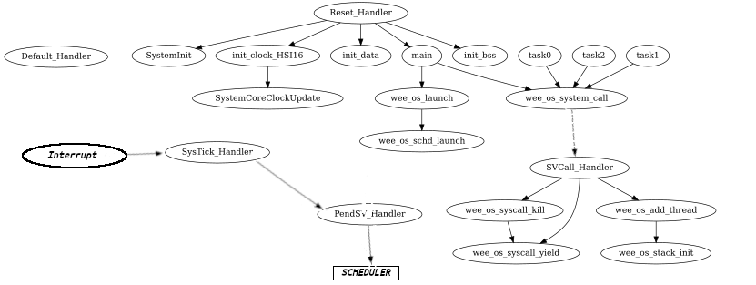

<p align="center">
  <h1 align="center">WeeOs API Documentation</h1>
</p>

<p>
  Here you can find details about all the functions provided by WeeOs.
</p>



<!-- TABLE OF CONTENTS -->
<details open="open">
  <summary><h2 style="display: inline-block">Table of Contents</h2></summary>
  <ol>
    <li><a href="#starting-weeos">Starting WeeOs</a></li>
    <li>
      <a href="#weeos.h">weeos.h</a>
      <ul>
        <li>
            <a href="#functions-provided-by-weeOsh">Functions Provided by weeOs.h</a>
            <ol>
                <li><a href="#1-wee_os_launchuint32_t-quanta">wee_os_launch()</a></li>
                <li><a href="#2-wee_os_addthreadtask_prop-task_property">wee_os_addthread()</a></li>
                <li><a href="#2-wee_os_yield">wee_os_yield()</a></li>
                <li><a href="#2-wee_os_kill">wee_os_kill()</a></li>
            </ol>
        </li>
      </ul>
    </li>
    <li>
      <a href="#mutex.h">mutex.h</a>
      <ul>
        <li>
            <a href="#functions-provided-by-mutexh">Functions Provided by mutex.h</a>
            <ol>
                <li><a href="#1-int-spin_lock_aquiremutex-lock">spin_lock_aquire()</a></li>
                <li><a href="#2-void-spin_lock_releasemutex-lock">spin_lock_release()</a></li>
            </ol>
        </li>
      </ul>
    </li>
  </ol>
</details>


<!-- ABOUT THE PROJECT -->
## Starting WeeOs

The Scheduler can be launched by calling wee_os_launch() from the main function. 
Before starting the scheduler, tasks have to be added into the the task-list.

A task is basically a function of type void task(void). Each task has an associated task_prop structure that holds information like pointer to the task function, name of the task, weight(in case of weighted_round_robin sheduling), etc.

The flow includes:- 
- Defining the task function.
- Declaring a task_prop for the task.
- Filling the task_prop with details of the task.
- Calling wee_os_addthread() to add the task to the task-list.
- The above steps are repeated to add more tasks.
- Calling wee_os_launch() to start the scheduler.

Once the scheduler starts, it automatically runs the first task in the list and keeps on scheduling other tasks as per the selected scheduling algorithm.

An Example where two tasks are being added and the scheduler is being started.

```c
#include <weeOs.h>

void task0(void)
{
    while(1);
}

void task1(void)
{
    while(1);
}

int main()
{
    task_prop task0_data = {
        .task = task0, 
        .name="TASK0"
    };

    task_prop task1_data = {
        .task = task1, 
        .name="TASK1"
    };

    wee_os_addthread(&task0_data);
    wee_os_addthread(&task1_data);
    wee_os_launch(10);

    /* This never runs as wee_os_launch never returns */
    while(1);
}
```

## weeOs.h
`#include <weeOs.h>`

This is the main header file for the WeeOs and it exposes all the basic functionality of the RTOS. This file has to be included in all projects using WeeOs.
## Functions Provided by weeOs.h
### 1. wee_os_launch(uint32_t quanta)
This function starts the scheduler with the given quanta.

Parameters - __uint32_t__ quanta : This is the quanta per task in ms.

Returns - __Void__ : This function should never return.

### 2. wee_os_addthread(task_prop *task_property)
This function add the task to the task-list. This has to be called before starting the scheduler. It can also be used by other tasks to spawn new tasks.

Parameters - __task_prop__ *task_property : This is the address of the task property structure of the task to be added.

Returns - __Void__ : This function returns void.

### task_prop structure
This structure defines the properties of a task.
Members of task_prop:-
- __.task__ : pointer of type void (*task)(void)
: This has to be assigned with the task's function.
- __.name__ : pointer of type char *
: This has to be filled with the name of the structure.
- __.weight__ : integer of type uint32_t
: This has to be assigned with the weight of the task. This is only applicable if the selected scheduling algorithm is weighted_round_robin

Example usage

```c
#include <weeOs.h>

void task0(void)
{
    while(1);
}

int main()
{
    task_prop task0_data = {
        .task = task0, 
        .name="TASK0"
    };

    wee_os_addthread(&task0_data);
    wee_os_launch(10);

    /* This never runs as wee_os_launch never returns */
    while(1);
}
```
### 3. wee_os_yield()
This function yields the CPU and forces a reschedule. After this call the task which is next in the task-list gets to run.

Parameters - __Void__ : This funtion doesn't take any arguments.

Returns - __Void__ : This function returns void.

### 4. wee_os_kill()
This function yields the CPU and removes the caller task from the task-list. After this call the caller task is never re-scheduled.

Parameters - __Void__ : This funtion doesn't take any arguments.

Returns - __Void__ : This function returns void.

## mutex.h
`#include <mutex.h>`

This header provides the support for busy wait spin-locks. The spinlocks have been implemented using hardware support.

## Functions Provided by mutex.h
### 1. int spin_lock_aquire(mutex *lock);
This function tries to get a lock and loops until it gets the lock

Parameters - __mutex__ lock : This is the lock which has to be aquired

Returns - __Int__ : This function always returns 0.

### mutex
The mutex type is used to declare locks, it has to be initialized to LOCKED or UNLOCKED.

Example usage

```c
#include <weeOs.h>
#include <mutex.h>

mutex lock = UNLOCKED;

volatile extern int a;

void task0(void)
{
    spin_lock_aquire(&lock);
    a++;
    spin_lock_release(&lock);

    while(1);
}

int main()
{
    task_prop task0_data = {
        .task = task0, 
        .name="TASK0"
    };

    wee_os_addthread(&task0_data);
    wee_os_launch(10);

    /* This never runs as wee_os_launch never returns */
    while(1);
}
```

### 2. void spin_lock_release(mutex *lock);
This function releases a lock.

Parameters - __mutex__ lock : This is the lock which has to be released.

Returns - __Void__ : This function returns void.
