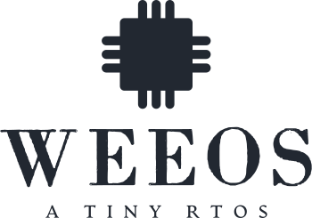

<!--
*** Thanks for checking out the Best-README-Template. If you have a suggestion
*** that would make this better, please fork the repo and create a pull request
*** or simply open an issue with the tag "enhancement".
*** Thanks again! Now go create something AMAZING! :D
***
***
***
*** To avoid retyping too much info. Do a search and replace for the following:
*** puranjaymohan, wee-os, twitter_handle, puranjay12@gmail.com, WeeOs, A tiny RTOS for ARM Cortex-M3/M4 based Microcontrollers.
-->


<!-- PROJECT SHIELDS -->
<!--
*** I'm using markdown "reference style" links for readability.
*** Reference links are enclosed in brackets [ ] instead of parentheses ( ).
*** See the bottom of this document for the declaration of the reference variables
*** for contributors-url, forks-url, etc. This is an optional, concise syntax you may use.
*** https://www.markdownguide.org/basic-syntax/#reference-style-links
-->
[![Contributors][contributors-shield]][contributors-url]
[![Forks][forks-shield]][forks-url]
[![Stargazers][stars-shield]][stars-url]
[![Issues][issues-shield]][issues-url]
[![MIT License][license-shield]][license-url]
[![LinkedIn][linkedin-shield]][linkedin-url]
[![Build Status][travis-ci-shield]][travis-ci-url]
[![Lines of code][lines-of-code-shield]][lines-of-code-url]


<!-- PROJECT LOGO -->
<br />
<p align="center">
  <a href="https://github.com/puranjaymohan/wee-os">
    
  </a>


  <p align="center">
    A tiny RTOS for ARM Cortex-M3/M4 based Microcontrollers.
    <br />
    <a href="https://github.com/puranjaymohan/wee-os/blob/master/APIDOC.md"><strong>Explore the docs »</strong></a>
    <br />
    <br />
    <a href="https://github.com/puranjaymohan/wee-os">View Demo</a>
    ·
    <a href="https://github.com/puranjaymohan/wee-os/issues">Report Bug</a>
    ·
    <a href="https://github.com/puranjaymohan/wee-os/issues">Request Feature</a>
  </p>
</p>


<!-- TABLE OF CONTENTS -->
<details open="open">
  <summary><h2 style="display: inline-block">Table of Contents</h2></summary>
  <ol>
    <li>
      <a href="#about-the-project">About The Project</a>
      <ul>
        <li><a href="#supported-hardware">Supported Hardware</a></li>
        <li><a href="#built-with">Built With</a></li>
      </ul>
    </li>
    <li>
      <a href="#getting-started">Getting Started</a>
      <ul>
        <li><a href="#prerequisites">Prerequisites</a></li>
        <li><a href="#building-weeos">Building WeeOs</a></li>
      </ul>
    </li>
    <li>
      <a href="#usage">Usage</a>
      <ul>
          <li><a href="#source-code">Source Code</a></li>
          <li><a href="#using-it-in-your-project">Using it in your project</a></li>
      </ul>
    </li>
    <li><a href="#roadmap">Roadmap</a></li>
    <li><a href="#contributing">Contributing</a></li>
    <li><a href="#license">License</a></li>
    <li><a href="#contact">Contact</a></li>
    <li><a href="#acknowledgements">Acknowledgements</a></li>
  </ol>
</details>


<!-- ABOUT THE PROJECT -->
## About The Project

WeeOs is a tiny RTOS for ARM Cortex-M3/M4 processors.
It currently supports two scheduling algoriths and four hardware devices.It includes a pre-emptive
scheduler that supports round-robin and weighted round-robin scheduling algorithms.
WeeOs if fully configurable. The scheduling algorithm and the hardware device can be set in the Makefile.

### Supported Hardware

* [ST NUCLEO-L476RG](https://www.st.com/en/evaluation-tools/nucleo-l476rg.html)
* [TI EK-TM4C123GXL](https://www.ti.com/tool/EK-TM4C123GXL)
* [Qemu lm3s811evb](https://wiki.qemu.org/Documentation/Platforms/ARM)
* [NXP MK64F12](https://www.nxp.com/products/processors-and-microcontrollers/arm-microcontrollers/general-purpose-mcus/k-series-cortex-m4/k6x-ethernet/kinetis-k64-120-mhz-256-kb-sram-microcontrollers-mcus-based-on-arm-cortex-m4-core:K64_120)

### Built With

* [GNU Arm Embedded Toolchain](https://developer.arm.com/tools-and-software/open-source-software/developer-tools/gnu-toolchain/gnu-rm/downloads)
* [CMSIS](https://www.arm.com/why-arm/technologies/cmsis)
* [OpenOCD](http://openocd.org/)
* [GNU Make](https://www.gnu.org/software/make/)


<!-- GETTING STARTED -->
## Getting Started

To get a local copy up and running follow these simple steps.

### Prerequisites

Install the prerequisites. Here is how to do it on Arch Linux.
* GNU ARM Embedded Toolchain
  ```sh
  sudo pacman -S arm-none-eabi-gcc
  ```
* OpenOCD
  ```sh
  sudo pacman -S openocd
  ```
* Packages for building, this is different for every distro. It includes things like GNU Make.
  ```sh
  sudo pacman -S base-devel
  ```

### Building WeeOs

1. Clone the repo
   ```sh
   git clone https://github.com/puranjaymohan/wee-os.git
   ```
2. Get inside the wee-os directory
   ```sh
   cd wee-os
   ```
3. Generate the config.mk file
   ```sh
   chmod +x configure.sh
   ./configure.sh
   ```
4. Edit config.mk to choose your hardware and scheduling algorithm. 
   ```sh
   #WeeOs Configuration File
   #Please edit this file to configure WeeOs

   #Name of the generated elf file
   PROJECT := main

   #Device for which the project has to be made
   #Available Devices: stm32l476rg lm3s811 MK64F12 TM4C123GH6PM
   DEVICE := stm32l476rg

   #Scheduling Algorithm used in the App
   #Available scheduling algorithms: round-robin weighted-round-robin
   SCHD_ALG := round_robin
   ```
5. Run Make to build the final elf file.
   ```sh
   make
   ```
6. Run OpenOCD in another terminal for your hardware.
   ```sh
   openocd -f /usr/share/openocd/scripts/board/st_nucleo_l476rg.cfg
   ```
7. Run GDB and upload the elf file to the target.
   ```sh
   arm-none-eabi-gdb build/main.elf -x scripts/gdb_commands
   ```

<!-- USAGE EXAMPLES -->

## Usage
### Source Code

The repository is divided into 3 main sub directories: src, device, and scripts.
The src directory includes two directories: App and Kernel. The App directory has the main.c file and all other supporting files required for the user's application. The Kernel directory has all the WeeOs files. The device directory has hardware specific filed like linker scripts etc. The scripts directory has some useful scripts.
  ```sh
├── device
│   ├── lm3s811
│   ├── MK64F12
│   ├── stm32l476rg
│   └── TM4C123GH6PM
├── images
│   └── logo.png
├── LICENSE
├── Makefile
├── README.md
├── scripts
│   ├── checkpatch.pl
│   └── gdb_commands
└── src
    ├── App
    └── Kernel
  ```

### Using it in your project

To use WeeOs in your project just setup WeeOs using the steps above.
Add your code to src/App.
You can add .c .h or .s files in the src/App folder and they will be compiled, assembled, and linked automatically while running make.
To create, add, kill tasks or use any other WeeOs feature, include the `#include <weeOs.h>` in your source file. 

To understand the usage of the WeeOs API have a look at API Documentation.

[API DOCUMENTATION](https://github.com/puranjaymohan/wee-os/blob/master/APIDOC.md)
<!-- ROADMAP -->

## Roadmap

See the [open issues](https://github.com/puranjaymohan/wee-os/issues) for a list of proposed features (and known issues).


<!-- CONTRIBUTING -->

## Contributing

Contributions are what make the open source community such an amazing place to be learn, inspire, and create. Any contributions you make are **greatly appreciated**.

1. Fork the Project
2. Create your Feature Branch (`git checkout -b feature/AmazingFeature`)
3. Commit your Changes (`git commit -m 'Add some AmazingFeature'`)
4. Push to the Branch (`git push origin feature/AmazingFeature`)
5. Open a Pull Request


<!-- LICENSE -->

## License

Distributed under the MIT License. See `LICENSE` for more information.


<!-- CONTACT -->

## Contact

Puranjay Mohan - puranjay12@gmail.com
Abhay Chirania - abhaychirania2411@gmail.com 

Project Link: [https://github.com/puranjaymohan/wee-os](https://github.com/puranjaymohan/wee-os)

<!-- ACKNOWLEDGEMENTS -->

## Acknowledgements

* [Operating Systems Lectures IITD](http://www.cse.iitd.ernet.in/os-lectures)
* [Build Your Own RealTime OS (RTOS) From Ground Up™ on ARM 1](https://www.udemy.com/course/rtos-building-from-ground-up-on-arm-processors/)

<!-- MARKDOWN LINKS & IMAGES -->
<!-- https://www.markdownguide.org/basic-syntax/#reference-style-links -->
[contributors-shield]: https://img.shields.io/github/contributors/puranjaymohan/wee-os.svg?style=for-the-badge
[contributors-url]: https://github.com/puranjaymohan/wee-os/graphs/contributors
[forks-shield]: https://img.shields.io/github/forks/puranjaymohan/wee-os.svg?style=for-the-badge
[forks-url]: https://github.com/puranjaymohan/wee-os/network/members
[stars-shield]: https://img.shields.io/github/stars/puranjaymohan/wee-os.svg?style=for-the-badge
[stars-url]: https://github.com/puranjaymohan/wee-os/stargazers
[issues-shield]: https://img.shields.io/github/issues/puranjaymohan/wee-os.svg?style=for-the-badge
[issues-url]: https://github.com/puranjaymohan/wee-os/issues
[license-shield]: https://img.shields.io/github/license/puranjaymohan/wee-os.svg?style=for-the-badge
[license-url]: https://github.com/puranjaymohan/wee-os/blob/master/LICENSE
[linkedin-shield]: https://img.shields.io/badge/-LinkedIn-black.svg?style=for-the-badge&logo=linkedin&colorB=555
[linkedin-url]: https://linkedin.com/in/puranjaymohan
[travis-ci-shield]: https://img.shields.io/travis/com/puranjaymohan/wee-os?style=for-the-badge
[travis-ci-url]: https://travis-ci.com/puranjaymohan/wee-os
[lines-of-code-shield]: https://img.shields.io/tokei/lines/github/puranjaymohan/wee-os?style=for-the-badge
[lines-of-code-url]: https://github.com/puranjaymohan/wee-os